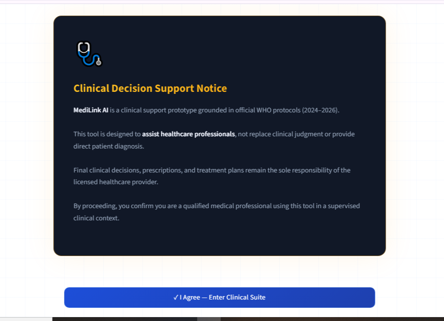
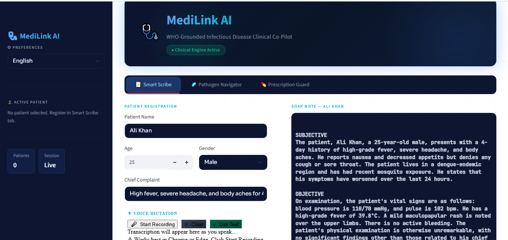
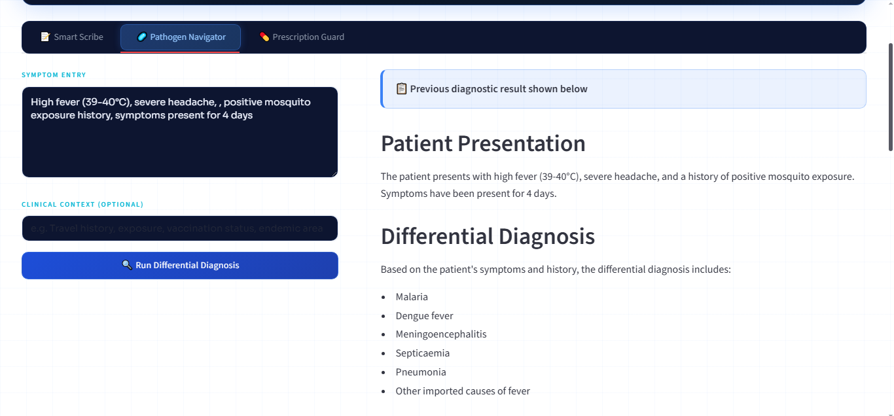
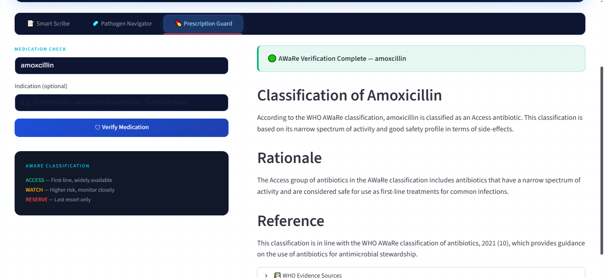

# 🩺 MediLink AI

## WHO-Grounded Infectious Disease Clinical Co-Pilot

**MediLink AI** is an AI-powered bilingual(English & Urdu) clinical decision support platform designed to assist healthcare professionals with infectious disease assessment, clinical documentation, antimicrobial stewardship, and evidence-based decision making using WHO guidelines.

---
⚠️ This system is intended for educational, research, and clinical support purposes only. It does not replace professional medical judgment.

## 🎥 Live Demo

🔗 Demo Link: https://medilinkai-qfwq52bjhd9fxb3rzzahgx.streamlit.app/

## 🚀 Features
### 📝 Smart Scribe
Generate structured SOAP notes from raw clinical observations.

- Patient registration
- Clinical note processing
- Voice dictation support
- Prescription image attachment
- Automatic SOAP note generation
- Patient record management
### 🦠 Pathogen Navigator
WHO-guideline-grounded differential diagnosis engine.

- Symptom analysis
- Differential diagnosis generation
- WHO management recommendations
- Evidence retrieval using RAG
- Clinical red flag detection
## 💊 Prescription Guard
Medication verification .

- WHO AWaRe classification lookup
- Medication appropriateness assessment
- WHO evidence-backed responses

## 🧠 Technology Stack

### Frontend
- Streamlit

### AI & LLM
- Llama 3.3 70B (Groq)
- LangChain

### RAG Pipeline
- FAISS Vector Database
- HuggingFace Embeddings
- all-MiniLM-L6-v2

### Knowledge Base
- WHO Infectious Disease Guidelines (2024–2026)

## 📚 Knowledge Base Sources

The system is grounded on curated WHO clinical guidelines and structured medical datasets:

- WHO Dengue Clinical Management Guidelines
- WHO AWaRe Antibiotic Classification (Access, Watch, Reserve)
- WHO Diabetes Management Protocols
- WHO Malaria Treatment Guidelines (2024)
- WHO Pocket Book of Primary Health Care
- Augmented Infectious Disease Symptom Dataset

## 🏗 System Architecture
```
Streamlit UI
   ↓
Application Layer (Session + Patient + SOAP + Red Flags)
   ↓
RAG Engine (FAISS + WHO Knowledge Base)
   ↓
LLM Engine (Groq LLaMA 3.3-70B)
   ↓
Prompt Engineering (WHO Clinical Templates)
   ↓
Clinical Outputs
(SOAP Notes • Diagnosis • Drug Classification)
   ↓
UI Rendering + Reports
```

## 📂 Project Structure
```
MediLink-AI/
│
├── app.py
├── config.py
│
├── core/
│   ├── llm_engine.py
│   ├── rag_engine.py
│   ├── prompts.py
│   └── utils.py
│
├── ui/
│   ├── sidebar.py
│   ├── smart_scribe.py
│   ├── navigator.py
│   ├── prescription.py
│   └── styles.py
│
├── components/
│   ├── voice_recorder.py
│   └── image_handler.py
│
├── data/
│   └── med_pathogen_brain/
│
├── assets/
│   ├── disclaimer_pg.png
│   ├── smart_scribe.png
│   ├── smart_scribe(cont).png
│   ├── smart_scribe(urdu).png
│   ├── smart_scribe(urdu_cont.).png
│   ├── pathogen_navigator.png
│   └── prescription_guard.png
│ 
└── requirements.txt
```

## ⚙️ Installation

### Create a virtual environment:

```bash
python -m venv venv
```
## Activate the environment
**Windows**
```bash
venv\Scripts\activate
```
**Linux / Mac**
```bash
source venv/bin/activate
```
## 📦 Install dependencies
```bash
pip install -r requirements.txt
```
## 🔑 Environment Variables

Create a .env file in the project root:
```
MediLinkAI_API_KEY=your_groq_api_key
```
Example:

MediLinkAI_API_KEY=gsk_xxxxxxxxxxxxxxxxxxxxx
## 🗂 Knowledge Base Setup

Place the FAISS database folder inside:
```
data/
└── med_pathogen_brain/
```
Expected files:
```
med_pathogen_brain/
├── index.faiss
└── index.pkl
```
## 🌐 Run Application
```bash
streamlit run app.py
```
Open in browser:

http://localhost:8501

## 🔮 Future Enhancements

- Persistent patient database integration 
- Secure cloud deployment 
- User authentication and role-based access control
- Advanced prescription analysis and drug interaction checking
- Laboratory result interpretation support
- Continuous knowledge base updates from latest WHO guidelines

## 🔒 Clinical Disclaimer

MediLink AI is a clinical support prototype grounded in official WHO protocols.

The platform:

- Assists healthcare professionals
- Provides evidence-based recommendations
- Supports antimicrobial stewardship
- Generates structured documentation

The platform does NOT:

- Diagnose patients independently
- Replace clinical judgment
- Replace licensed medical professionals
- Final clinical decisions remain the responsibility of the healthcare provider.

## 📸 Application Screenshots

### Disclaimer Page


### 📸 Modules
### Smart Scribe (English)

| English Interface | English(cont.) Interface |
|------------------|----------------|
|  | .png) |

### Smart Scribe (Urdu)

| Urdu Interface | Urdu(cont.) Interface |
|------------------|----------------|
| .png) | .png) |
### Pathogen Navigator


### Prescription Guard


👨‍💻Developed as an AI-powered healthcare innovation project demonstrating the integration of Large Language Models, Retrieval-Augmented Generation, and evidence-based clinical decision support.
